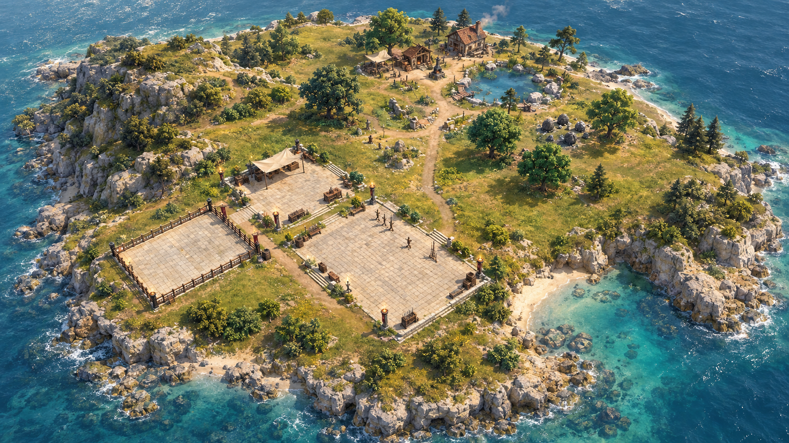

# Compact island target concept

Generated on 2026-09-11 using the built-in image-generation tool. This is a visual
reference, **not an actual game screenshot, performance result or launch claim**.
Generated prop counts, tents, cliffs and paths are not approved gameplay layouts.
Preserve authoritative resource identity, collision, navigation and one duel arena.

Source references were actual probe40 wide and campus-link screenshots. The
reference is used for material/vegetation/lighting hierarchy; each implementation
must be independently verified in the actual WebGPU world.

## Exact generation prompt

Use case: stylized-concept
Asset type: game environment art-direction reference, explicitly a CONCEPT rather than an actual game screenshot.
Input images: Image1 is a top-down layout reference of the current compact island. Image2 is an oblique layout reference of the same island. Ignore all UI/text in both.
Primary request: Develop this existing compact agent-dueling island into an exceptionally polished, cohesive, high-end real-time fantasy environment. Keep the actual functional composition: ONE rectangular duel ring in the southern campus, adjacent staging and recovery courtyards, short path north to bank/workshop buildings, forge/anvil and resource preparation stations, small northern fishing pond, existing harvestable broadleaf/conifer trees; western low rocky ridge and southeast coastal inlet. The whole island is only roughly 330m across, not an epic continent.
Style/medium: sophisticated stylized realism with grounded PBR materials, plausible realtime rasterized-game detail and clean readable gameplay space, not photoreal offline path-traced cinematics. Make the environment beautiful through strong composition, harmonious natural color, convincing material scale and curated modular clusters, not extreme polygon noise.
Environment: natural gently asymmetric limestone headland and curved sheltered inlet with rock shelves and shallow teal coastal water. Layered meadow has broad patches of dry straw, muted sage and moss green, short grass near routes, sparse taller grass at edges, exposed soil under tree clusters, low bushes and weathered boulders joining landforms. All canopy trees must read as accessible harvestable resources, not a wall of decorative forest. Build on the existing compact layout rather than adding castles or huge buildings.
Architecture/surfaces: warm aged limestone courtyards that sit convincingly in the ground, worn joint edges and subtle varied blocks, modest timber-and-stone northern workshops with readable roof materials. Edge planting, subtle retaining stones, dirt-to-paving transitions; keep all duel/navigation areas open. Single arena unmistakable.
Composition/framing: one wide landscape 3/4 aerial overview, similar to the second layout reference but showing the whole island including both coasts. Human scale, not a toy disk. Fine detail should support readable medium-scale regions.
Lighting: balanced natural late-morning sun, neutral skin/material response, restrained warm key and cool sky fill, stable soft contact shadows, light atmospheric perspective, clear shallow/deep water distinction. No exaggerated bloom or oversaturated golf-course lawn.
Constraints: exactly one duel arena; no additional island or distant large world; no HUD, writing, logos, watermarks, invented flags or giant castle; preserve functional relative layout and scale; no new character designs. This is a target concept, never presented as implemented engine output.
