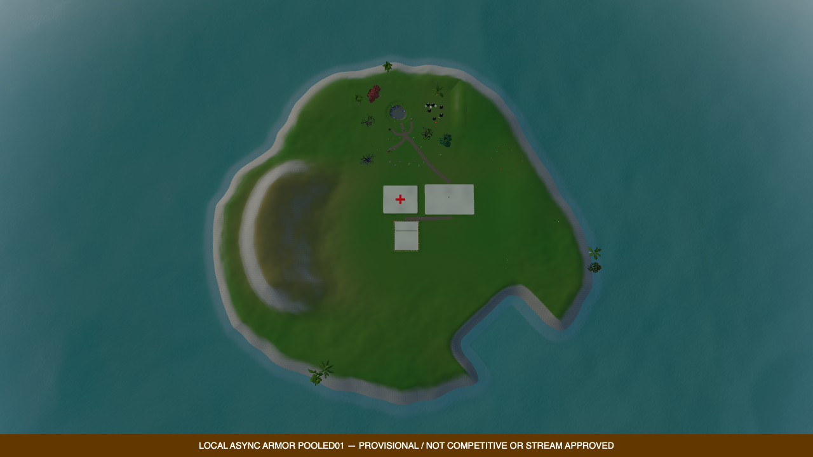
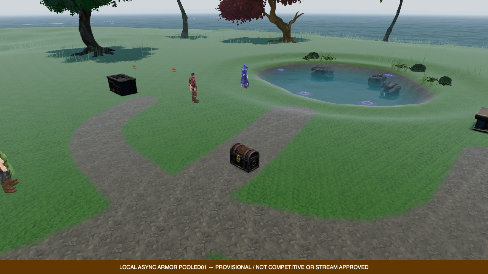

# Compact island vegetation and world readability — candidate verified, 2026-09-11

## Baseline and acceptance boundary

The material checkpoint is pushed as
`f5687e535279767ac06a43d0a0e8060afd351147` on `codex/sol-duel-stream-launch`.
Remote HEAD and GitHub author/committer `dreaminglucid` are verified. All eight
committed TypeScript blobs match the actual probe44 source pins after normal
commit hooks. Its spatial study passes, but the whole run fails inherited
cow/dagger content errors. Its images do not meet the visual target.

This next slice addresses three concrete causes of the barren/placeholder look,
not a claim that vegetation alone delivers the finished environment. Canonical
render defaults remain unchanged. New grass quality requires an explicit
qualification profile and an honest increase in geometry/instance cost.

## Functional tree residency

Probe42's initial client census has eight tree entities: all five authored trees
and `tree_311_295`, `tree_377_288`, `tree_335_266`. Five additional distant trees
are approved by the actual generator but were not proven instantiated in that
live server. A separate real-class server-role World/EntityManager/Terrain/
RoadNetwork/Resource startup reproduces exactly eight; this CPU reproduction is
not a retrospective live server census.

Two implementation defects explain the missing content. Initial/update residency
uses `floor(x/100)` despite centered tile ownership `floor((x+50)/100)`. The
actual lobby `(385,374)` belongs to tile `4_4`, whose core contains all eight
procedural trees. In addition, initial terrain-only ring tiles are permanently
skipped by subsequent enqueue/generate/update paths; `contentGenerated` never
promotes. Existing tiles `3_5` and `5_4` remain empty after the actual update.

The implemented fix uses the centered convention consistently and promotes only newly
eligible core content, once, preserving the existing tile/geometry/collider and
every resource's identity and depletion state. Keep outer-ring terrain preloading
explicit. Bound queued/in-flight upgrades and reject stale work after unload,
replacement or destruction. Do not alter manifests, seed, species, yields or RNG.
The number of _instantiated_ trees nevertheless increases; that rendering and
server cost must be measured rather than called unchanged population.

Late joining is a separate authority gate. Initial spectator entity snapshots use
a 110m followed-bot radius, while future resource events reach spectators globally.
The all-resource snapshot currently emits state events but does not itself create
missing local entities. Test already-depleted resources before local load and
later promotion; full trees must not appear when authority says depleted. Current
per-view evidence lacks unique tree IDs and cannot certify that retrospectively.

## Grass: coverage and explicit cost

The untouched actual worker reproduces probe44's six nearby leaf inputs: twelve
clumps / 48 blades / 48 triangles. Fixed broadcast LOD2 places clumps at 14m
spacing. Simply allowing LOD1 changes that to 2.8m and 337 clumps / 12,132 triangles,
but still leaves zero sampled campus and pond-bank clumps. The older forest
grass-weight threshold rejects ground that the compact material displays as grass.

A bounded CPU trial of LOD1 plus actual compact-material grass support yields
2,130 clumps / 76,680 triangles across those same six leaves, including 143 campus
and seven pond-bank clumps. These are CPU candidate measurements, not engine
capture approval or a full-island worst case. Regional counts overlap. Physical
slope, water, path and authored-floor exclusions stay in place; no global zero
threshold, new random call or resource-tree replacement is intended.

The proposed profile retains 140m culling, spacing multiplier four, one chunk
upload per frame, no grass shadow casting, and no new textures. LOD1 has twelve
blades / 60 vertices / 36 triangles per clump. The six-leaf trial has at most six
nonempty batches instead of four, a 272,640-byte sum across reported instance
attributes (not unique backing-buffer memory), 34,080 bytes of retained computed-
base evidence and 12,816 bytes of cloned base geometry.
CPU generation/transfer/upload, vertex and pixel costs can increase. Measure them.

Preflight artifacts are `asset-studio/game-test-integration/grass-profile-preflight01/`
(`census01.mjs`, `report01.json`). The counter-instrumented and non-instrumented
workers produce identical outputs in every case. Baseline/LOD-only cases execute
the original production worker; compact eligibility is an explicitly transformed
external candidate, not yet a runtime implementation. All inputs remain pinned.
The frozen runtime now implements the candidate as explicit `island-720p60-v1`;
canonical/fallback/shadow defaults are unchanged. Actual production-worker tests
reproduce all three populations above and main/worker attributes agree. The
preflight's historical external transformation remains unchanged evidence, not
the script used to build the runtime. Actual WebGPU qualification is pending.

## Integrated source verification

Normal shared, client and server builds pass, as do the shared/client/server
typechecks and scoped lint/format checks. The root integrated regression run
passes **365 unique cases across 25 files**: shared 249/22, client streaming 35/2
and server capture policy 81/1. The new residency tests exercise actual CPU world
classes and native workers, centered boundaries, exactly 13 resource entities,
one-time promotion without replacing geometry/colliders, depleted-resource state,
queue pruning and stale callbacks after unload/replacement/destruction. This is
not a browser, persistent late-join or visual acceptance claim.

The mob lifecycle fixture now reads the admitted profile seed rather than an old
hard-coded seed 91 that contradicted the actual descriptor. Its deterministic
assertions remain intact; production profile guards were not relaxed.

The new profile reports its actual grass manager, eligibility, terrain descriptor,
spacing, LOD, range and bounded queue/instance counts. The server independently
validates that receipt rather than trusting a client `ready` flag. Broadcast scene
marker suppression leaves gameplay markers and zone safety behavior intact.

Probe45 is retained as a **prelaunch failure**, not a GPU attempt: the expanded
capture source closure encountered one newly pinned client TSX test outside the
existing exact allowlist. No browser or owned service started. The next launcher
must admit that one verified source path explicitly and test the complete expanded
path closure without weakening the non-secret source policy.

Probe46 reached real Chrome/Metal WebGPU but **failed before the spatial study**.
The new readiness collector required `TreeProxy.userData.resourceType`; tree
construction initially writes it, but `Entity.init()` subsequently calls generic
`setupInteraction()`, which replaces the proxy metadata without that optional
field. All 13 actual entities have the correct resource type, exact current pool,
parent and proxy identity. Both retained censuses also contain all nine completed
core tiles, zero pending terrain/grass work and 2,130 installed clumps in six LOD1
batches. These observations do not turn the aborted study into a pass. Its single
failure screenshot is not a vegetation art review or a cadence measurement.

The readiness deadline is retained at 30,001 ms, with the same failure across 116
observations. The corrected check must follow completed production initialization
and validate exact proxy name/entity ID/parent plus actual entity configuration;
it must not mutate runtime metadata to satisfy a test. Source/asset bytes remained
unchanged. The same 19 cow/dagger errors remain; GPU/page errors are zero. The
launcher again reports a process-group EPERM inspection failure and exits 1,
although its owned browser closes and all four ports are free. That cleanup
failure remains recorded, not waived.

## Scene markers and visual review

Broadcast/embedded spectator navigation emojis are suppressed by presentation
policy; ordinary gameplay keeps them. Zone detection, borders, warnings and
interactions are untouched. Two focused policy tests pass. Verify that actual
broadcast scene objects contain no `zone-marker-*` sprites, not merely that a
screenshot helper hides them. These house icons were never town buildings.

The next live study must retain all original screenshots, exact HUD restoration,
source/asset pins, camera restoration, error reporting and owned-process cleanup.
Record actual unique tree IDs, grass counts/buffers, pending queues and geometry
before/after the views. Review ground-level and wide views for visible coverage,
root contact, path/pond clarity, natural clustering and retained combat readability.
Do not claim moving-camera smoothness, LOD stability, thermal scalability or
decoded-stream quality from stills or render-counter progress.

Open beyond this slice: natural coast/cliff dressing, a fuller functional woodland
layout if still needed after residency repair, terrain repetition, buildings and
station dressing, skin/metal/light balance, stable shadows, animation, sound,
whole-loop play, late-join authority, real GPU/frame-tail/thermal budgets and the
separate cow/dagger content errors. The generated concept is reference art only.

## Actual engine result — probe47

**Spatial/content study PASS; whole run FAIL; visual target NOT met.** The frozen
game sources run in actual headful Chrome/Metal WebGPU using explicit
`island-720p60-v1`, 1280×720, DPR1, MSAA4 and medium shadows. No production default
was promoted. Root's successor capture regressions pass 148 cases, including the
seven source-closure cases; the inherited obsolete eight-floor fixture remains
the single specifically named historical skip, with current three-floor gates
still required. No GPU result is inferred from those tests.

- All 13 exact resource entities, their current visual owners and completed nine-
  tile core are present before and after the study. The separate readiness check
  passes on its first observation in 27 ms, after the unchanged cold/equip clock.
- Both censuses contain 2,130 clumps in six installed LOD1 batches: 76,680 base
  grass triangles. This population increase is intentional and is not free.
  Live attribute byte-length receipts total 136,320 bytes after counting shared
  interleaved color/tint storage once, plus 34,080 bytes of retained CPU grounding
  evidence. Neither is total grass/native GPU memory; instance matrices, other
  base buffers, materials and driver allocations are not measured by that sum.
- All 67 scene censuses contain zero `zone-marker-*` objects, including invisible
  objects. All original camera, geometry, material/lighting and HUD gates pass.
  Eleven HUD leases restore their exact DOM state. All 39 PNGs are retained.
- Grass observations cover 140,580 repeated installed anchors, not that many
  unique plants. Computed height/normal/water/exclusion/invalid-instance counts
  are zero; maximum installed-owner height error is 0.0000018982 m. The separate
  projection offset from the worker height field reaches **0.731104 m** over the
  expanded population; do not describe the worker field as identical to rendered
  terrain or imply every blade/pixel is proven in contact.
- Zero GPU/page errors; the same 14 invalid dagger-fit messages and five missing-
  cow load errors remain. The launcher itself exits 0, its browser closes, all
  four owned ports are free and no cleanup error is recorded. The overall harness
  exits 1 because the application content errors remain. Probe46's earlier EPERM
  result remains failed; this clean shutdown does not erase it.

Scheduling observations, **not GPU durations, presented FPS or a matched A/B**:

| Window                                         | RAF p95 |  RAF p99 | Largest RAF interval |
| ---------------------------------------------- | ------: | -------: | -------------------: |
| Cold navigation through first equip (29.513 s) | 49.6 ms | 158.4 ms |             666.6 ms |
| Post-equip, 10 s                               |  8.9 ms |   9.3 ms |              16.6 ms |
| Post-study, 10 s                               | 17.1 ms |  25.2 ms |              50.5 ms |

The camera, daylight and visible populations differ between windows and from
probe44. The post-study tail is not a smooth-60-FPS acceptance result; full moving-
camera, GPU, shadow, thermal and representative-client budgets remain open.

Positive render-call-group intervals give another scheduling view: post-equip
601 groups (all +4 calls), p95/p99/max 17.3/17.6/17.6 ms; post-study 577 groups
(323 × +4, 254 × +6), 25.0/33.1/50.5 ms. Both cameras move. Lighting changes from
night/exposure 1.1 in the first window to declining daylight/exposure 0.853–0.915
in the latter, so they are not equivalent rendering workloads. The 304.6 ms
median / 392.5 ms maximum grass CPU diagnostic scan is excluded from the isolated
cadence windows and is not normal frame cost.

Root reviewed the actual night kit, bank, campus-link and wide-island images. The
bank reads more cleanly without huge house sprites, and distant resource trees
are now instantiated. However, grass still appears sparse/wispy, terrain remains
repetitive, the bay is box-like, the perimeter a uniform gray band, and the wide
island lacks woodland and convincing buildings. Large paving blocks, pale skin,
metal/night balance and hard foliage shadows need further art work. This is a
functional presentation checkpoint, emphatically not AAA or launch approval.

These are unedited byte-identical copies of two real probe47 PNGs. The owned HUD
diagnostic temporarily hides only 2D stream HUD and restores it; the amber
provisional banner remains. They are not concept art or a decoded-stream test.

Evidence directory: `asset-studio/game-test-integration/compact-world-probe47/`.
Independent audit matches all **443 source pins, 374 archives and 39 PNGs** to
exact bytes/hashes and checks both standalone JSON closures against the report.
All six published/applied render states match the explicit profile. Each of the
11 HUD leases hides 178 nodes and restores exact state; total hide/capture/restore
time is 238.4–328.9 ms, under the unchanged 450 ms cap. The 156,292,947-byte report
is diagnostic artifact volume, not application memory usage. Exact hashes:

- Report: `d73da8cf0507e5c952ed1011253e49a1edffdaf9f08070954b5815d2513197a8`
- Spatial: `4111ad772aa83a7325201b9ad709410858024c95fcc5153e0cc79e8594c58a52`
- Presentation: `62a8591c1c7f09d1c67b3e4e5a03609a9fc9167288559111a4667c0644bc1a4c`
- Wide PNG: `7477195aa90381b2819663cfedf37a3d9d99355b5afc07cd0470583680252243`
- Bank PNG: `7cce4d84c57854b4b65882cd6d560eab6b920420e3df4c87ef44616285a01f6f`

## Next implementation slices

1. Shape a tapered, gently bent bay with unequal banks inside the current refined
   envelope. Version the terrain contract, preserve functional grades/resources,
   and target the same geometry, material and collider counts. More tessellation
   alone does not correct a constant-width rectangular height-field cut.
2. Inspect and prepare [Poly Haven Coastal Cliff 02](https://polyhaven.com/a/coastal_cliff_02)
   as an authoring module under its [CC0 asset license](https://polyhaven.com/license).
   Do not install its full-resolution source. Establish actual LOD, material,
   texture, collision and silhouette budgets before one in-engine placement.
3. Complete the authoritative resource-snapshot and late-join repair: direct
   owned-socket initial delivery, session-scoped availability retained before
   local entity publication, correct depletion/respawn across unload/reconnect.
   The current 13-tree presence gate does not establish this behavior.
4. Refine actual grass appearance and functional woodland distribution, then
   architecture/paving and coherent lighting/material/shadow presentation. Keep
   stream, animation/audio, gameplay and sustained performance launch gates open.
