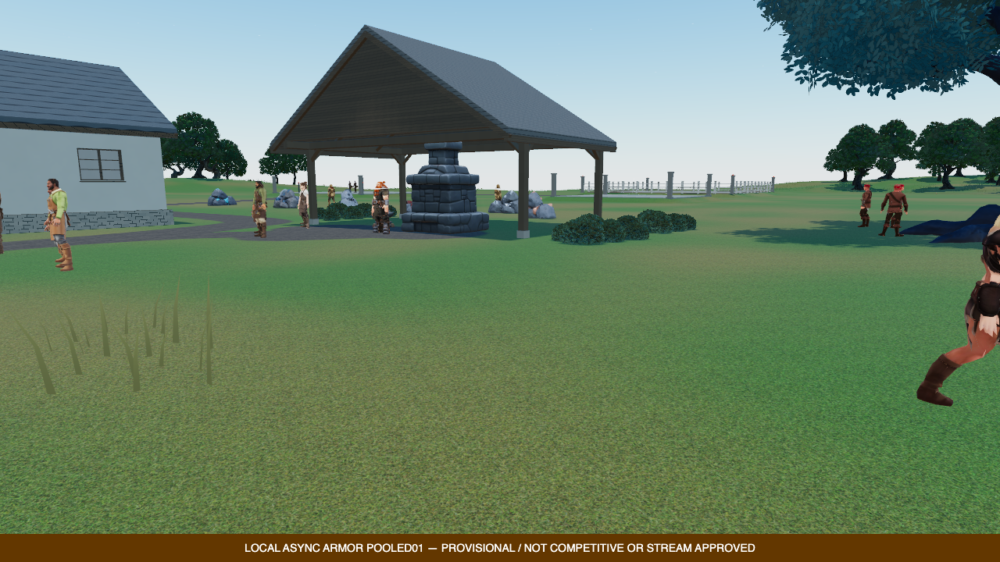
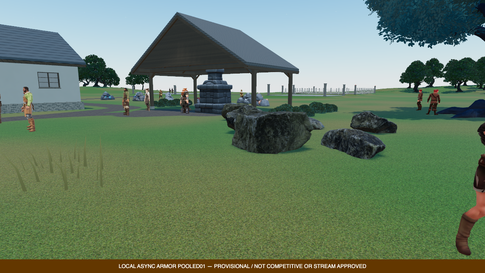

# Scanned outcrop integration — 12 September 2026

Status: render-owner implementation, regressions and native render-path test
complete. No default-world placement or production approval. Assets commit:
`6726595374adfed59e44dac49d75a4f4c0d82437` on `codex/duel-arena-launch-assets`.

## What changed

- Reused the three previously prepared, closed CC0 scanned rocks, not the rejected
  40m open cliff facade. Bay and ridge facade placement failures remain valid.
- Packaged all nine geometry alternatives in one explicitly consumed library,
  preserving original maps, material, geometry, UVs and child pivots.
- Added a bounded render owner: up to 48 placements, three variants, three levels,
  shared cached geometry/material, instancing, bounds-based culling, projected
  geometric-error selection with hysteresis, and no unchanged matrix uploads.
- Corrected cold ModelCache material conversion so multiple meshes using the same
  effective source material share one conversion. Different vertex-color variants
  remain separate. This is not a repair of every independent-clone/material policy.
- Added an actual-geometry CPU test suite and a temporary six-rock WebGPU art test.
  The prototype samples the lower 20% vertex band of all LODs against retained
  installed Float32 terrain triangles with 4cm burial. This is not exhaustive
  underside coverage or collision qualification.

The package is 2,993,320 bytes; source near geometry is about 8k triangles per rock,
medium 2k, far 500. The original 2K texture atlas stays unchanged. The shared atlas
still has a meaningful memory cost; no memory/performance win is inferred merely
from instancing or triangle counts.

## Verification

- **1,225 tests passed across 90 files**, including model-cache, processed-codec,
  outcrop, terrain, worker, grass, world-content and placement regressions.
- 17 native-harness/art-path preflight tests passed; the retained closure adds
  exactly four inputs (owner, test, native study, GLB), rather than removing prior
  source pins. 667 preflight pins plus 12 dynamic inputs; 600 archived inputs.
- Shared/server/client builds and typechecks, scoped ESLint and formatting passed.
- Final native evidence: `asset-studio/game-test-integration/rock-outcrops-native03`.
  Headful nonfallback Chrome/Metal WebGPU; 1280×720/DPR1/MSAA4, unchanged quality.
  [Independent evidence summary](evidence/compact-rock-outcrops-20260912.json)
  verifies 679 source pins, 600 archives (62,213,276 bytes), 16 PNGs and exact
  delivered GLB bytes. Browser, launcher and all four owned ports closed.
  A post-run lint cleanup only canonicalized two test literals to their identical
  IEEE754 value; the seven focused tests were rerun. Runtime/assets/bundles remain
  byte-identical to native03 and the original test source remains archived.
- Six rocks produce three actual main-pass draws/47,856 triangles at near detail;
  three/3,000 at far detail. Returning retains medium for one small distant rock
  inside the hysteresis band: four draws/41,928 triangles. No double-rendered LODs.
- The placement prototype made 7,108 actual retained-terrain support queries.
  Before/after natural-daylight phase changed by 0.006667; cameras and rendering
  settings match. Agents and sunlight continued moving, so pixels are not frozen.
- Zero page/GPU/cleanup errors. Study passes, **overall diagnostic remains failed**
  on five missing-cow and fourteen dagger fit-metadata errors. These are preserved.

## Actual visual verdict

All eight native world views and both rock images were directly reviewed. The
scanned shapes and material detail are useful, with no obvious floating from this
camera, but the test composition is not approved: six rocks on the flat lawn do
not create a cohesive landscape. The larger ridges remain rounded and synthetic,
ground transitions are airbrushed, understory sparse/repetitive, and foliage/light
too cool in places. Those are substantial art gaps, not solved by this checkpoint.

Native01 preserved a report-checker failure: two new photos were omitted from its
expected list. Native02 corrected that but exposed a wrong test expectation that
all rocks must immediately return to near detail. Independent pixel-error arithmetic
and a new hysteresis regression confirm the legitimate retained-medium state;
native03 verifies all three actual draw cases. Neither earlier report is rewritten.

## Required before installation

- Inspect matched actual game images for material/color, roots, scale and shadow
  contact. A good neutral Blender sheet is not sufficient.
- Choose permanent terrain-relative placements away from paths, services and
  functional trees; verify complete exposed geometry and all LOD contact.
- Add shared authoritative navigation and actual visible triangle collision where
  rocks occupy walkable terrain. Test agent paths and gathering approach points.
- Test native cold/processed-cache reload, camera motion and LOD transitions.
- Measure incremental draw, CPU, GPU, loading and memory costs with identical
  rendering settings; test maximum approved population, not just six rocks.
- Continue the larger landform/material/shoreline/foliage/light pass. These small
  outcrops cannot by themselves fix the island silhouette or establish AAA quality.

## Sources used

[Poly Haven's scanned rock set](https://polyhaven.com/a/rock_moss_set_02) and its
[CC0 policy](https://polyhaven.com/license) supply the source assets. The render
owner follows Three's [instancing and bounds contract](https://threejs.org/docs/pages/InstancedMesh.html)
and uses hysteresis as in its [LOD mechanism](https://threejs.org/docs/pages/LOD.html).
The numerical pixel-error thresholds are provisional project choices, not values
promised or prescribed by those sources.
