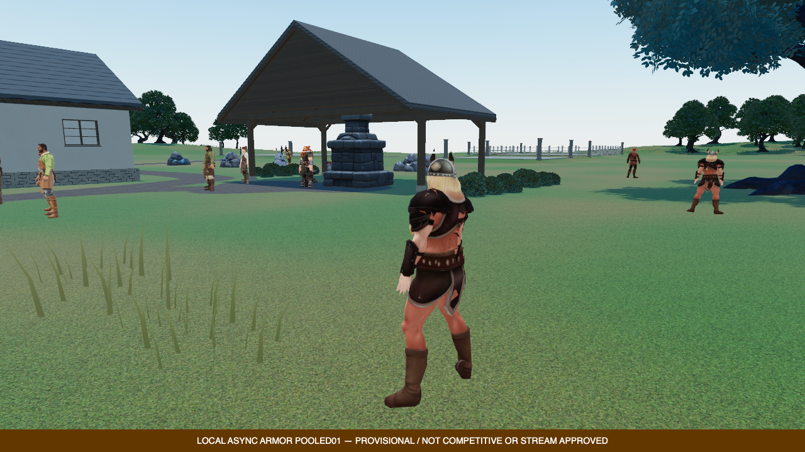
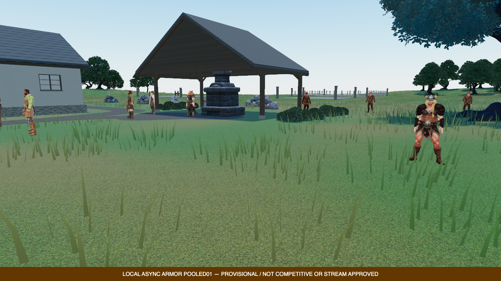
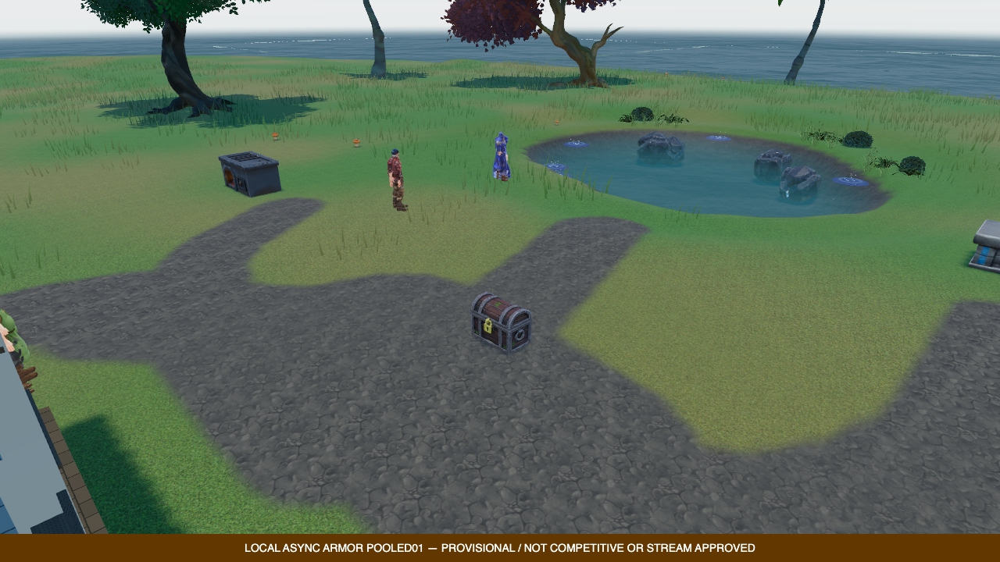

# Denser meadow: verified trial, unfinished visual result

## Campus clearance and spatial-query correction

The broad `duel_arena_campus_grade` blended across X292–444 / Z324.5–457 and
implicitly excluded grass, including the southern preparation meadow. Its
grass exclusion is now explicitly false. Real arena, lobby, hospital, lodge
and station clearances remain; the grading height, roads and resource layout
do not change. This one-line manifest change belongs to the separate assets
repository and must accompany the game-side grounding optimization.

Restoring coverage initially exceeded the dense profile's existing work cap.
Grounding now conservatively filters base-query terrain surfaces and indexes
road capsules into a bounded 8×8 grid. Shared-edge ordering, exact triangle and
capsule predicates, complete swept coverage, cancellation and all hard limits
remain. The original arithmetic outputs match; the work counter now records
fewer irrelevant tests. No density, detail or quality reduction was made.

The new native run installed **11,657 clumps** / **1,119,072 correction bytes**
over six complete owners. Loading fitting took 630.5ms in active slices with
a 5.3ms maximum slice, still above the 2ms target. Actual ten-second p95 CPU
ticks were 13.1ms/10.6ms and GPU-pass sums 18.35ms/16.45ms for campus/meadow.
These are not presented FPS, full GPU wall time, a controlled before/after
speedup benchmark or stable full-population 60FPS qualification.

Native Chrome/Metal/nonfallback WebGPU retained 1280×720, DPR1, MSAA4, existing
shadows and 1.75m spacing. Study passed; overall failed on the same 19 cow/dagger
errors. No new page/GPU/cleanup errors. All owned test browser/launcher/ports
closed. All eight world views were reviewed; missing coverage is visibly
fixed, but flat/spiky blades, synthetic terrain and basic lighting/building
materials still fail the requested visual standard. Opening baseline images
retain their loading overlays and are not used as world-view approval.

Same meadow camera before the clearance correction:

After the clearance correction:

1,233 shared tests / 90 files, 24 external tests against the untouched original
core, 22 native preflights, all three builds/typechecks and scoped lint pass.
Large leaves are independently reconstructed from bounded original-reference
partitions; production remains one bounded job, without increasing its caps.
Historical fixture inputs are reconstructed explicitly and old census oracles
retained. New tests cover road/grid/terrain boundaries, exterior wind sweeps,
exact current worker counts and unchanged sampled heights/protected pads.

Native report SHA-256:
`94838871037d870f42ceb2eeabcb3aee141bbe47934575e99fa24f1e078b7017`.
`asset-studio/compact-grass-grounding-integration01/campus01/verify.mjs --check-only`
checks 679 current source pins, 600 saved source archives and all 16 PNG
artifacts, plus the previous dense baseline's immutable report/archives.
Initial work-limit/test-fixture failures are retained with their explanations.

Next visible pass: curved blade shape and coherent soft normals, then native
moving-view, shading/contact and cost checks. The [AMD grass research](https://gpuopen.com/learn/mesh_shaders/mesh_shaders-procedural_grass_rendering/)
provides useful curve/normal/LOD principles; its native mesh-shader code is not
a browser feature claim. G04 and the AAA goal remain OPEN.

## Earlier density-only checkpoint

The opt-in `island-meadow-720p60-v1` render profile selects `compact-meadow-v2`
grass. It increases placement density from 2.8m to 1.75m spacing without
changing the existing island/default broadcast selections, blade geometry,
material, shadow policy, range or rendering quality. This is not promotion to
the default experience, whole-world art approval or production readiness.

## Actual result

Native Chrome 152 / Metal / Apple M5, nonfallback WebGPU, 1280×720, DPR 1,
MSAA 4 and the existing 4096px sun shadow map:

| Measurement                 | Original density, clean repeat | Dense trial |
| --------------------------- | -----------------------------: | ----------: |
| Retained clumps             |                          2,275 |       5,798 |
| Root-correction bytes       |                        218,400 |     556,608 |
| Completed terrain owners    |                              6 |           6 |
| Failed/pending fitting jobs |                              0 |           0 |
| Total active fitting slices |                        473.0ms |     811.6ms |
| Maximum fitting slice       |                          5.4ms |       4.7ms |

The last two rows describe cooperative loading work, not per-frame steady-state
cost. The 2ms target still has overshoot. These runs are not a controlled
speedup benchmark: live actors and natural lighting time differ. An earlier
baseline run also overlapped CPU tests and is explicitly ineligible for a
clean performance comparison. No result or error was discarded.

Dense-scene ten-second instrumented windows recorded p95 CPU client ticks of
17.7ms (campus) and 15.1ms (meadow), and p95 render/compute GPU-pass sums of
19.14ms and 21.76ms. These are **not presented FPS or total GPU wall time**;
they do not qualify the full scene for stable 60 FPS. No density, resolution
or shadow downgrade was used to conceal the cost.

## Visual verdict

Direct review covered all eight world views, the baseline overview and the
temporary outcrop composition. Pond-side coverage is visibly fuller. The
preparation foreground remains too sparse, blade shading reads flat/bristly,
and the distant terrain still looks airbrushed with synthetic ridge forms.
The density increase alone is **not the requested quality jump**.

Same camera/quality, separate native daylight runs; actors are not frozen:

Original density:

Dense trial:

Next: diagnose the distribution around the preparation area, improve curved
blade/soft-normal shading and coverage transitions, then retest moving views
and actual GPU cost. Terrain, large geology, sky, lighting, water, buildings,
asset fit/animation and soundscape remain separate unfinished tasks. Do not
raise caps or claim AAA quality to make a candidate pass.

## Grounding and verification

Cheap float validation now yields per bounded 32-value block; the fade/wind
envelope yields per blade, at most fourteen transforms. Every original
geometric work charge and arithmetic operation stays in order. Cancellation,
terrain/constraint epochs, triangle contact, exclusions, upload pacing and
existing hard work/time limits remain. The resumption counter is explicitly
different from the receipt's geometric work counter.

- 1,230 shared tests across 90 files pass, including both render-profile
  admissions, historical placements, lifetime/invalidation and grounding.
- 19 external tests compare the untouched original numerical algorithm with
  the current production core/worker inputs at both densities and all LODs.
  Only elapsed time is excluded from the preexisting result-field comparison.
- 22 capture preflight checks; shared/client/server builds and typechecks;
  scoped ESLint/Prettier and diff whitespace checks pass.
- Native render study passes with all 5,798 clumps; **overall report fails** on
  the existing five missing-cow and fourteen dagger-fit metadata errors. No
  new page/GPU/cleanup errors. All owned browsers, launchers and ports closed.
- 679 source pins and 600 source archives verified for the dense run, plus
  all 16 required image artifacts. Its report SHA-256 is
  `fb59fc94ab85cd303e161f63f46d61e418734d743ee026cca8f61299a492198f`.

Local evidence is retained under
`asset-studio/compact-grass-grounding-integration01/batching01/` and
`asset-studio/game-test-integration/dense-meadow-native01/`.
`batching01/verify.mjs --check-only` verifies the archived runs and exact dense
source delivery. Older run source hashes intentionally differ after the
separately captured profile addition; their original archives remain intact.

[AMD's procedural grass research](https://gpuopen.com/learn/mesh_shaders/mesh_shaders-procedural_grass_rendering/)
informs the next shape, normal and density-transition work. Its native mesh
shader implementation is not a WebGPU feature claim or a drop-in replacement.
No third-party plugin/code was imported in this pass.
